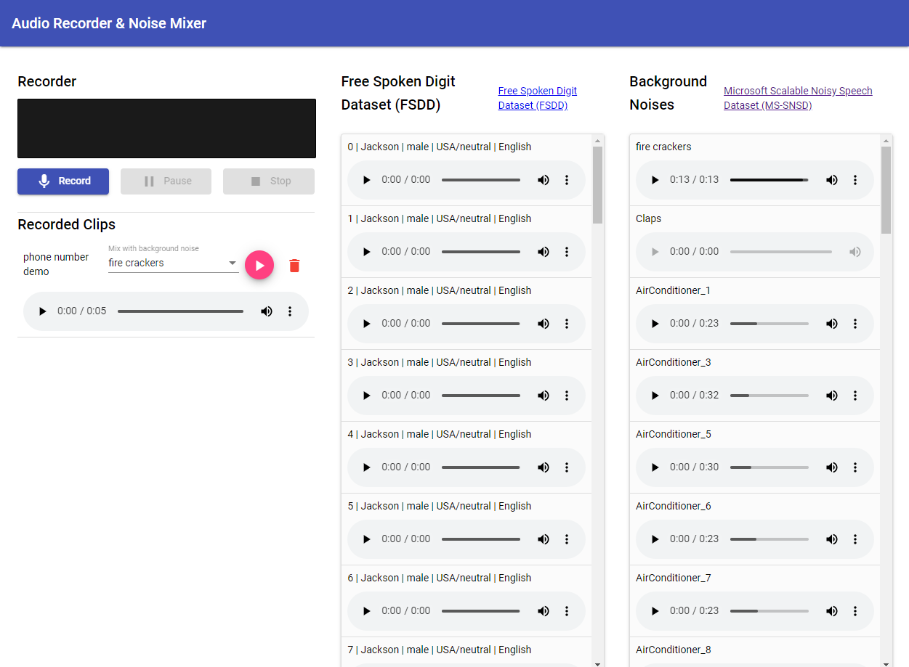

# ActionDynamicForms

This project was generated with [Angular CLI](https://github.com/angular/angular-cli) version 9.1.8.

## The Goal of Action Dynamic Forms

The ActionDynamicForms creates dynamic form using JSON schema.

# Getting Started - Local Development

## Installation

To get started locally, follow these instructions:

1. Clone to your local computer using `git`.
2. Make sure that you have Node 10.13 or later installed. See instructions [here](https://nodejs.org/en/download/).
3. Make sure that you have `yarn` installed; see instructions [here](https://yarnpkg.com/lang/en/docs/install/).
4. Install the Angular CLI globally.
```shell
npm install -g @angular/cli
```
5. Run `yarn` (no arguments) from the root of your clone of this project to install dependencies.
```shell
cd <path-to-action-dynamic-form-folder>
yarn
```
6. Run `yarn start` for a dev server. Navigate to `http://localhost:4200/`. The app will automatically reload if you change any of the source files.
```shell
yarn start
```


# Form Field JSON Schema

The form is generated from array of IFormFieldConfig object:

## IFormFieldConfig

| Property | Type | Description | Examples |
|---|---|---|---|
**type** | FormFieldType (required) | Type of the field. | 'input' &#124; 'textarea' &#124; 'checkbox' &#124; 'radio' &#124; 'select'
**label** | string (optional) | Label of the field. | 
**name** | string (required) | Form/Model name of the field. | 
**inputType** | string | Type of input field. | 'text' &#124; 'email' &#124; 'number'
**options** | TextValuePair[] (optional) | Array of values for select, radio form field. | `[{ "value": true, "text": "Yes"},{ "value": false, "text": "No"}]`
**value** | any (optional) | Initial value of the field. | 
**required** | boolean (optional) | Whether the form field is required. | 
**size** | string (optional) | Width of the form field. | `100% or 200px`
**minLength** | number (optional) | Min length of the input form field. | 
**maxLength** | number (optional) | Max length of the input form field. | 
**hint** | string (optional) | Text for the form field hint. | 


## Development server

Run `ng serve` for a dev server. Navigate to `http://localhost:4200/`. The app will automatically reload if you change any of the source files.

## Code scaffolding

Run `ng generate component component-name` to generate a new component. You can also use `ng generate directive|pipe|service|class|guard|interface|enum|module`.

## Build

Run `ng build` to build the project. The build artifacts will be stored in the `dist/` directory. Use the `--prod` flag for a production build.

## Running unit tests

Run `ng test` to execute the unit tests via [Karma](https://karma-runner.github.io).

## Running end-to-end tests

Run `ng e2e` to execute the end-to-end tests via [Protractor](http://www.protractortest.org/).

## Further help

To get more help on the Angular CLI use `ng help` or go check out the [Angular CLI README](https://github.com/angular/angular-cli/blob/master/README.md).
